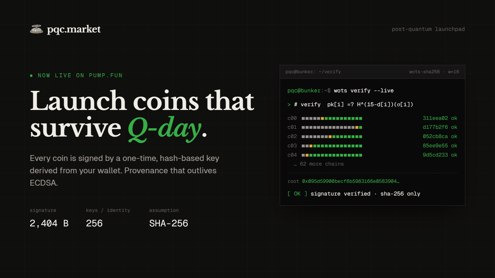

<p align="center">
  <a href="https://pqc.market"></a>
</p>

<h1 align="center">pqc.market</h1>

<p align="center">
  The post-quantum launchpad on pump.fun.<br>
  Every coin is signed by hash-based keys derived from your wallet — provenance that outlives ECDSA.
</p>

<p align="center">
  <a href="https://pqc.market">pqc.market</a> ·
  <a href="https://pqc.market/docs">Docs</a> ·
  <a href="https://x.com/pqcmarket">@pqcmarket</a>
</p>

---

## Why

Solana addresses *are* ed25519 public keys. There is no hash shield like a never-spent Bitcoin address: if the curve falls, to a cryptographically relevant quantum computer or to a classical advance nobody saw coming, every account is exposed at once.

pqc.market gives creators a post-quantum identity today and uses it to sign every launch. The signatures rest on SHA-256 alone (or, optionally, on the NIST post-quantum standards), so proof of who launched a coin keeps working after ed25519 does not.

## How it works

| Step | What happens |
|---|---|
| **Derive** | Your wallet signs a fixed message. Its deterministic signature (plus an optional scrypt-hardened passphrase) seeds 256 Winternitz one-time keys, generated in the browser in about half a second. Secrets never leave the tab. |
| **Register** | The keys hash into a Merkle tree. Its root is your post-quantum public key; a hash of it is your `pq1…` address. One statement is signed by both your wallet and leaf 0, binding them in both directions. |
| **Anchor** | An SPL memo records the root on Solana while ed25519 is still trustworthy, a timestamp any post-break claim can be checked against. |
| **Launch** | A fresh one-time key signs the coin's mint, creator, name, ticker and image. The coin is created on the pump.fun bonding curve in a single transaction, with the attestation pinned into its IPFS metadata. |
| **Verify** | Anyone can rebuild the digest from public fields and check it against the creator's root. The coin page does this in your browser, step by step. |

## Signature schemes

WOTS + Merkle is every identity's root of trust and burns one leaf per launch. The NIST schemes are many-time keys derived from the same identity seed; each is certified once by a WOTS leaf, then signs any number of launches.

| Scheme | Standard | Assumption | Signature | Public key |
|---|---|---|---|---|
| WOTS + Merkle (XMSS-style) | RFC 8391 style | SHA-256 second preimage | 2,404 B | 64 B |
| ML-DSA-65 (Dilithium) | FIPS 204 | Module-LWE / SIS lattices | 3,309 B | 1,952 B |
| SLH-DSA-SHA2-128s (SPHINCS+) | FIPS 205 | SHA-256, stateless | 7,856 B | 32 B |
| Falcon-512 (FN-DSA) | FIPS 206 draft | NTRU lattices | ≤ 666 B | 897 B |

Hash-based primitives are implemented in [`src/lib/pq`](src/lib/pq) (WOTS w=16 over a tweakable SHA-256, Merkle tree of height 8). The NIST schemes come from [`@noble/post-quantum`](https://github.com/paulmillr/noble-post-quantum). The full protocol, including message formats, the threat model and a security analysis, is at [pqc.market/docs](https://pqc.market/docs).

## Verify a coin yourself

```ts
import { launchDigest } from "@/lib/pq/messages";
import { verify } from "@/lib/pq/xmss";

const meta = await fetch(metadataUri).then((r) => r.json());
const d = launchDigest({
  mint, creator, name: meta.name, symbol: meta.symbol,
  image: meta.image, leaf: meta.pqc.signature.leaf,
});
const { valid } = verify(d, meta.pqc.signature, {
  root: meta.pqc.root, pubSeed: meta.pqc.pubSeed, height: meta.pqc.height,
});
```

Nothing but SHA-256 is involved. No server, no API, no curve.

## What it protects, and what it does not

- **Protects:** coin provenance after a curve break; account ownership via a WOTS challenge-response login that never consults ed25519; one-time key reuse, enforced at the database level.
- **Does not yet:** funds in ordinary Solana accounts are still guarded by ed25519. Holding value under hash-based keys needs an on-chain verifier program, which is on the roadmap.
- Wallet-only identities are only as strong as the wallet. Use the passphrase.

## Stack

Next.js 16 · React 19 · Tailwind 4 · [`@pump-fun/pump-sdk`](https://www.npmjs.com/package/@pump-fun/pump-sdk) · Reown AppKit (Solana) · Supabase (Postgres + Realtime) · Helius RPC · Birdeye market data · Pinata IPFS · Redis cache · `@noble/hashes`, `@noble/curves`, `@noble/post-quantum`

## Running locally

```bash
pnpm install
pnpm dev
```

Create a `.env` with the following (names only; bring your own values):

```
HELIUS_RPC_URL                  # Solana RPC
PUMPFUN_LOOKUP_TABLE            # pump.fun address lookup table
SUPABASE_URL                    # + SUPABASE_SERVICE_ROLE_KEY (server)
NEXT_PUBLIC_SUPABASE_URL        # + NEXT_PUBLIC_SUPABASE_ANON_KEY (browser, RLS-guarded)
BIRDEYE_API_KEY
PINATA_JWT                      # + NEXT_PUBLIC_PINATA_GATEWAY
NEXT_PUBLIC_PROJECT_ID          # Reown AppKit
NEXT_PUBLIC_TREASURY            # on-chain creator for every launch
REDIS_URL                       # optional; falls back to in-memory cache
ADMIN_PASSWORD                  # /admin
PQC_PLATFORM_SEED               # 32 random bytes, hex; seeds the platform identity
```

Apply the schema with the Supabase CLI:

```bash
pnpm dlx supabase db query --linked -f supabase/migrations/0001_pqc_init.sql
# then 0002…, 0003…, 0004… in order
```

## Layout

```
src/lib/pq/          WOTS, XMSS-style tree, key derivation, message formats, schemes
src/lib/server/      Supabase, Solana/pump.fun, Birdeye, Pinata, Redis cache, platform identity
src/app/api/         identity, launch, prove, market, token, admin routes
src/components/      UI, brand kit, verification trace
supabase/migrations  schema (every table is pqc_-prefixed, RLS on)
```

## Links

- Site: [pqc.market](https://pqc.market)
- Docs: [pqc.market/docs](https://pqc.market/docs)
- X: [@pqcmarket](https://x.com/pqcmarket)
